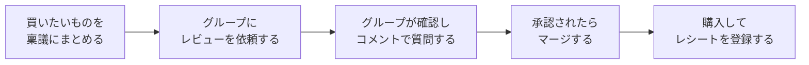
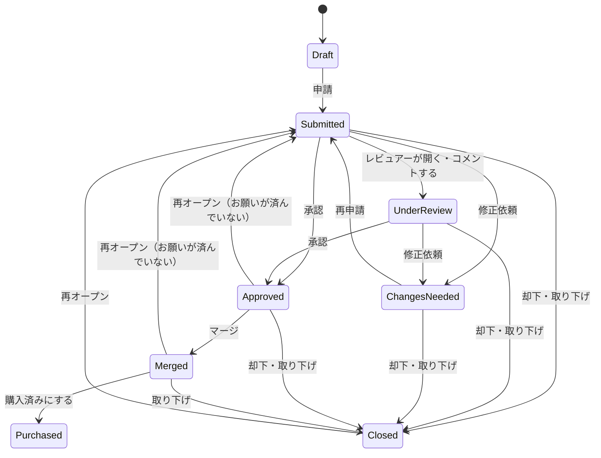
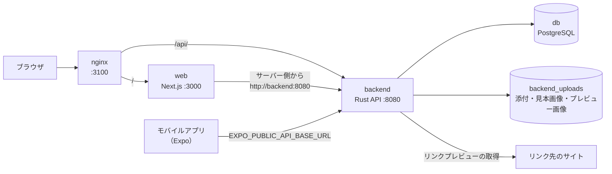

# RingiWoMerge — 稟議をマージ

> **Big purchases deserve a review.** 大きな買い物は、グループのレビューを通してから。

家庭内で高額な商品・サービスを買うときに、買いたい人が理由・価格・商品リンク・比較・資料をまとめて**稟議**として申請し、グループが確認・質問・承認できるアプリ。GitHub の Pull Request の流れを、GitHub を知らない人にもわかる言葉で、家庭の購入判断に使う。承認された稟議は**マージ**され、「グループが購入に合意した」ことになる。

## コンセプト

グループの大きな買い物は、口頭やチャットで何となく決まりがちである。その結果、なぜ買ったのか・何と比べたのか・誰が良いと言ったのかが残らず、「言った・言わない」になったり、欲しい人の説明が足りないまま押し切ったりしてしまう。

RingiWoMerge は、**家庭内の大きな意思決定を、レビューできる形にする**ことで、これをなくす。

```text
Request → Review → Comment → Approve → Merge → Purchase
```

| 考え方 | 内容 |
|---|---|
| 「欲しい」を、説明できる形に | 金額・理由・商品リンク・比較・資料を1つの稟議にまとめる。単なる「欲しい」ではなく、なぜ必要か・何に使うか・今の物ではなぜ足りないかを書く |
| グループがレビューして、話し合う | グループは内容を確認し、コメントで質問したり、修正を依頼したりできる。やり取りはすべて時系列で残る |
| 納得したら、マージする | 承認された稟議をマージする＝グループが購入に合意した。「稟議が通った」を「マージされた」と言う |
| GitHub を知らなくても使える | 画面は日本語で、見た目は Pull Request の画面に寄せる。専門用語は使わず、「マージ」だけを大事な言葉として残し、初回に説明する |
| 買ったあとまで、ひとつの場所で | 実際の金額・レシートを登録して購入済みにする。支出はダッシュボードで振り返れる |

| 項目 | 内容 |
|---|---|
| ステータス | **MVP 実装済み・拡張機能まで実装済み**（[ロードマップ](#16-開発ロードマップ)の Phase 1・Phase 2 完了。公開デモ <https://expense.makoto-kamimura.com> で稼働中。Phase 3 の本番化は未着手） |
| リリース日 | 未定（Phase 3 の本番化の完了時に正式リリースする予定） |
| 作成者 | **Makoto Kamimura** — [@makoto-kamimura](https://github.com/makoto-kamimura) |

このREADMEは、プロジェクト紹介と仕様書を兼ね、次の2部と付録で構成する。

| 部 | 内容 | 主な読者 |
|---|---|---|
| [第1部 概要説明](#第1部-概要説明) | サービスの目的、機能と画面の仕様、MVPの範囲、ロードマップ | すべての人 |
| [第2部 技術説明](#第2部-技術説明) | 技術スタック、システム構成、クイックスタート、実装方針、データモデル、API、非機能要件 | 開発者 |
| [付録](#付録) | 決定事項、未決事項 | すべての人 |

そのほかの資料（運用手順書・タスクなど）は [docs/](docs/README.md) に置く。

## 目次

- [コンセプト](#コンセプト)
- [第1部 概要説明](#第1部-概要説明)
  - [特徴](#特徴) / [使い方のイメージ](#使い方のイメージ)
  - [1. 概要](#1-概要) / [2. 用語](#2-用語) / [3. ユーザー種別と権限](#3-ユーザー種別と権限) / [4. 基本フロー](#4-基本フロー) / [5. 画面一覧](#5-画面一覧)
  - [6. 認証とアカウント](#6-認証とアカウント) / [7. グループと設定](#7-グループと設定) / [8. 稟議](#8-稟議) / [9. レビュー](#9-レビュー) / [10. マージと購入](#10-マージと購入)
  - [11. アクティビティと変更履歴](#11-アクティビティと変更履歴) / [12. まとめ資料](#12-まとめ資料) / [13. ダッシュボード](#13-ダッシュボード) / [14. 家事のコミット](#14-家事のコミット)
  - [15. MVPの範囲](#15-mvpの範囲) / [16. 開発ロードマップ](#16-開発ロードマップ)
- [第2部 技術説明](#第2部-技術説明)
  - [17. 技術スタックとシステム構成](#17-技術スタックとシステム構成)（[クイックスタート](#175-クイックスタート)を含む）
  - [18. 認証の実装](#18-認証の実装) / [19. 機能ごとの実装方針](#19-機能ごとの実装方針) / [20. データモデル](#20-データモデル) / [21. API](#21-api) / [22. 非機能要件](#22-非機能要件)
- [付録](#付録)
  - [23. 決定事項](#23-決定事項) / [24. 未決事項](#24-未決事項)

---

# 第1部 概要説明

サービスの目的・機能・画面の仕様をまとめる。技術的な内容は[第2部](#第2部-技術説明)に分ける。

## 特徴

| 特徴 | 内容 |
|---|---|
| Pull Request 型の稟議 | 下書き → 申請 → レビュー → 承認 → マージ → 購入済み、の流れでグループの合意を取る。見た目・配色は GitHub (Primer) の Pull Request 画面に寄せる（Open = 緑 / Draft = 灰 / Merged = 紫 / Closed = 赤） |
| 稟議の種類 | 初期は 🛍 購入 / 📍 外出・イベント / ✨ 提案。管理者が種類を追加・名前変更・非表示にできる。種類は3つの型（購入型 / 外出・イベント型 / 提案型）のどれかを土台にし、流れは共通で、項目名と完了の表現（購入済み / 行ってきた / やった）が型で変わる |
| 比較と資料 | 比較する商品（比較表）、見積書・カタログ・スクリーンショットなどの資料を添付できる |
| リンクプレビュー | 商品URL・比較商品のURLから画像とタイトルを自動で取得し、一覧・詳細・比較表・まとめ資料に表示する |
| レビュー | コメント / 修正依頼 / 承認 / 却下。レビューのチェックポイント（理由・URL・比較・資料・家事の実績）を自動で表示する |
| 分岐 | 既存の稟議から「その後でやりたいこと」などを派生させる（Git のブランチ風）。分岐元と分岐先を相互にリンクする |
| ラベル | グループごとの色付きラベル（生活・日用品・趣味・娯楽・旅行・移動、急ぎ・記念日・イベント・タイミング待ちなど）で分類し、一覧を絞り込む |
| 記録が残る | 誰が・いつ・何をしたかをアクティビティに時系列で残す。編集は項目ごとに変更前 → 変更後の差分で見られる |
| まとめ資料 | 稟議の内容をスライドにして話し合いで見せる。Web は全画面の投影モードと持ち時間タイマー付き、印刷で A4 横の PDF |
| 購入の記録 | 実際の金額・購入日・注文番号・レシートを登録する。モバイルはレシートを撮影すると金額と日付を自動で入力する |
| ダッシュボード | 件数・レビュー待ち・支出合計・ラベル別の支出と、自分の家事の実績 |
| 家事のコミット | 掃除・洗濯などの家事を「コミット」して記録し、草グラフ・連続日数・トロフィーで見える化する。申請者の家事の実績は、稟議のレビューでも参考にされる |
| Web とモバイル | Web（Next.js）とモバイルアプリ（Expo）の両方で使える。グループの設定は Web で行う |
| 表示の切り替え | 「端末に合わせる / ライト / ダーク（黒背景）」を選べる。初期値は端末に合わせる |

## 使い方のイメージ



たとえば、パパがグループ旅行用に 12 万円のカメラを買いたいとき：

1. 商品・金額・購入先・理由・商品URLを入力し、比較した商品と資料を添付して、ママをレビュアーにして申請する。
2. ママが内容を確認し、「今のカメラでは何が足りないの？」とコメントする。
3. パパが理由を書き足して再申請し、ママが承認する。
4. グループの合意として稟議を**マージ**し、購入する。
5. 実際の金額とレシートを登録して、**購入済み**にする。

## 1. 概要

### 1.1 ポジショニング

GitHub の Pull Request の考え方を、家庭内の高額な購入の判断に置き換えた、グループ向けの購入レビュー・承認アプリ。会社の稟議ほど堅苦しくせず、**GitHub の開発文化 × 家庭内の意思決定**を組み合わせる。

| 取り込み元 | 取り込む要素 | 本サービスでの形 |
|---|---|---|
| GitHub の Pull Request | 申請・レビュー・コメント・承認・マージ、タイムライン、ラベル、ブランチ、コントリビューションの草グラフ | **稟議**（[第8〜11章](#8-稟議)）、**家事のコミット**（[第14章](#14-家事のコミット)） |
| 会社の稟議 | 理由・比較・見積の添付、決裁の記録、会議用の資料 | 稟議の項目（[第8章](#8-稟議)）、**まとめ資料**（[第12章](#12-まとめ資料)） |
| 家計簿 | 実際の支出、分類ごとの集計 | **購入の記録**（[第10章](#10-マージと購入)）、**ダッシュボード**（[第13章](#13-ダッシュボード)） |

### 1.2 原則

**利用者に GitHub の知識を求めない。** 「稟議を作る → グループがレビューする → 承認されたらマージする → 購入する」という流れだけを理解すれば使えるようにする。「マージ」だけは、プロダクトの核になる言葉として残し、初回のオンボーディングとマージのボタンで意味を説明する（マージ＝グループが購入に合意したこと）。

### 1.3 想定ユースケース

| ユースケース | 種類 | 例 |
|---|---|---|
| 家電・ガジェットの買い替え | 🛍 購入 | 「グループ旅行用のカメラ」12万円 |
| 趣味の道具 | 🛍 購入 | 「ロードバイク」「ゲーミング PC」 |
| みんなでのお出かけ | 📍 外出・イベント | 「水族館」「日光旅行」 |
| 習い事・体験 | ✨ 提案 | 「スイミング教室」「キャンプ」（日光旅行から分岐） |

## 2. 用語

画面は日本語で表示する。内部の概念（元の仕様の英語の UI 用語）と画面の表示の対応は次のとおり。

| 用語 | 英語（内部の名前） | 意味 |
|---|---|---|
| 稟議 | Request / Purchase Request | グループに合意を求める申請。種類は初期の「購入」「外出・イベント」「提案」と、管理者が作った種類 |
| 申請者 | Requester | 稟議を作った人 |
| レビュアー | Reviewer | 稟議を確認・承認する人。申請者が稟議ごとに選ぶ |
| 管理者 | Admin | グループの設定（メンバー・権限・ラベル・家事の項目）を管理する人 |
| グループ | Family | データの単位。メンバーは1つのグループに所属し、稟議はグループの中でだけ見える |
| 申請 / 再申請 | Submit / Submit Again | 下書き・修正依頼の稟議をレビューに出すこと |
| レビュー | Review | 稟議の内容を確認すること |
| コメント | Comment | 稟議への質問・回答 |
| 修正依頼 | Request Changes | レビュアーが追加の情報や修正を求めること |
| 承認 | Approve | レビュアーが問題ないと判断すること |
| 却下 | Reject | レビュアーが認めないと判断すること（稟議はクローズになる） |
| 取り下げ | Close | 申請者が稟議をやめること |
| 再オープン | Reopen | クローズした稟議や、承認したらしてほしいことが済んでいない稟議を、レビュー待ちに戻すこと |
| 承認したらしてほしいこと | Approval Tasks | 申請者がレビュアーに、承認するときにお願いしたいこと（例：カレンダーに予定を入れる） |
| マージ | Merge | 承認された稟議を確定すること。グループが購入に合意したことを表す |
| 購入済み | Purchased | 実際に購入したこと（外出・イベント型は「行ってきた」、提案型は「やった」） |
| 分岐 | Branch | 既存の稟議から派生させた稟議 |
| ラベル | Label | 稟議の分類。グループごとに作る |
| 資料 / レシート | Attachments | 稟議に添付するファイル。判断の材料が「資料」、購入後の証憑が「レシート」 |
| アクティビティ | Activity | 稟議に対する操作とコメントの時系列の記録 |
| まとめ資料 | Summary | 稟議の内容のスライド表示 |
| 家事のコミット / プッシュ | Commit / Push | 家事をやったことの記録 / 対象の家事をすべてやったことの確定 |

## 3. ユーザー種別と権限

### 3.1 種別

権限はグループのメンバーごとのフラグで、1人が複数を兼ねられる。

| 権限 | できること |
|---|---|
| 申請者（Requester） | 稟議を作成・編集・申請・取り下げ・削除（自分の稟議）し、マージ後に購入済みにする |
| レビュアー（Reviewer） | 自分がレビュアーに選ばれた稟議に、承認・修正依頼・却下をする |
| 管理者（Admin） | グループの名前・招待コード・メンバーの権限・ラベル・家事の項目を管理する。グループの稟議を削除できる |

- グループを作った人は、すべての権限を持つ。招待コードで参加した人の初期値は、申請者＋レビュアー。
- 権限の変更は、すぐに反映される（ログインし直す必要はない）。

### 3.2 稟議ごとの操作

「申請者」「レビュアー」は、その稟議の申請者と、その稟議に選ばれたレビュアーを指す。

| 操作 | できる人 | できる状態 |
|---|---|---|
| 編集 | 申請者 | 下書き・修正依頼 |
| 申請 / 再申請 | 申請者（レビュアーが1人以上必要） | 下書き・修正依頼 |
| 承認・修正依頼 | レビュアー | 申請済み・レビュー中 |
| 却下 | レビュアー | 申請済み・レビュー中・修正依頼・承認済み |
| マージ | 申請者・レビュアー | 承認済み |
| 購入済みにする | 申請者 | マージ済み |
| 取り下げ | 申請者 | 申請済み・レビュー中・修正依頼・承認済み・マージ済み |
| 再オープン | 申請者・レビュアー | クローズ |
| 再オープン（お願いが済んでいない） | 申請者（「承認したらしてほしいこと」があるときだけ。コメント必須） | 承認済み・マージ済み |
| 削除 | 申請者・管理者（他人の下書きは見えないので消せない） | すべて（完了した稟議を消すと、支出の集計からも消える） |
| コメント | グループのメンバー（下書きは申請者のみ） | すべて |
| 資料の添付 | 申請者 | 完了以外 |
| レシートの添付 | 申請者 | マージ済み・購入済み |
| ラベルの付け外し | 申請者・レビュアー | すべて |

- 下書きは、申請者本人にしか見えない。
- 当事者でない人の操作は拒否し（403）、状態が合わない操作も拒否する（409）。

## 4. 基本フロー

### 4.1 はじめて使う

1. アカウントを登録する。このとき、グループを新しく作る（管理者になる）か、招待コードでグループに参加するかを選ぶ。
2. 初回のログインで、3ステップのオンボーディング（[6.2節](#62-オンボーディング)）が表示される。
3. 管理者は、設定画面の招待コードを招待したい人に伝える。

### 4.2 稟議を作って申請する

1. 「新しい稟議」から種類を選び、タイトルと金額を入力する（途中でも下書きとして保存できる）。
2. 購入先・理由・商品URL・比較する商品・ラベル・メモを入力し、資料を添付する。
3. レビュアーを選んで申請する。

### 4.3 レビューする

1. レビュアーが稟議を開くと、状態がレビュー中になる。
2. 内容とチェックポイントを確認し、コメントで質問する。
3. 承認・修正依頼・却下のどれかをする。修正依頼を受けた申請者は、内容を直して再申請する。

### 4.4 マージして購入する

1. 承認された稟議を、申請者かレビュアーがマージする。「承認したらしてほしいこと」が済んでいなければ、申請者が再オープンしてレビューに戻せる。
2. 申請者が購入し、実際の金額・購入日・注文番号・レシートを登録して購入済みにする。

### 4.5 家事をコミットする

1. マイページで、その日にやった家事の「コミット」を押す。
2. 対象の家事をすべてやったら「プッシュ」して、トロフィーを受け取る。

## 5. 画面一覧

### 5.1 Web

上部のタブは「ダッシュボード / 稟議 / レビュー / マイページ / 設定」。ヘッダーの右側で表示（端末に合わせる / ライト / ダーク）を切り替えられ、ブラウザごとに Cookie で覚える。

| 画面 | パス | 内容 |
|---|---|---|
| ログイン | `/login` | |
| 登録 | `/register` | グループの作成か、招待コードでの参加 |
| トップ | `/` | ログイン中はマイページへ移動する。未ログインなら紹介ページ |
| オンボーディング | `/onboarding` | 初回の3ステップの説明 |
| 稟議の一覧 | `/requests` | フィルター・種類（`?type=<id>`）・ラベルでの絞り込み。`?filter=to_review` は「レビュー」タブ |
| 新しい稟議 | `/requests/new` | `?parent=<id>` で分岐、`?copy=<id>` で複製 |
| 稟議の詳細 | `/requests/[id]` | 会話（タイムライン）・サイドバー（レビュアー・ラベル・申請者の家事）・マージボックス |
| 変更履歴 | `/requests/[id]/history` | 詳細の「履歴」タブ |
| 稟議の編集 | `/requests/[id]/edit` | |
| 購入済みにする | `/requests/[id]/purchase` | |
| まとめ資料 | `/requests/[id]/summary` | スライド・投影モード・印刷 |
| ダッシュボード | `/dashboard` | |
| マイページ | `/chores` | 今日の家事・実績。`?period=day\|week\|month`。ログイン後の最初の画面 |
| 家事の見本 | `/chores/[id]` | きれいな状態の見本画像 |
| 設定 | `/settings` | グループ・メンバー・招待コード・ラベル・家事の項目 |

### 5.2 モバイルアプリ

| 画面 | 内容 |
|---|---|
| ログイン | |
| オンボーディング | 初回の3ステップの説明 |
| 稟議の一覧 | フィルター・サムネイル・ラベル |
| 新しい稟議 / 編集 | |
| 稟議の詳細 | レビューの操作・ラベルの付け外し・再オープン・申請者の家事の実績 |
| 購入済みにする | レシートの撮影と OCR による自動入力 |
| 変更履歴 | |
| まとめ資料 | |
| ダッシュボード | |
| マイページ | 1行1家事の一覧と「まだ / 済み / すべて」の絞り込み。ログイン後の最初の画面 |
| 家事の見本 | 見本画像の閲覧 |

表示（自動 / ライト / ダーク）は、マイページ上部の「表示」ボタンで切り替え、端末に保存する。

グループの作成・メンバー管理・ラベルと家事の項目の管理は、Web の設定画面で行う。

## 6. 認証とアカウント

### 6.1 登録とログイン

- メールアドレス・パスワード・名前で登録し、同時にグループを作るか、招待コードで参加する。
- 表示名は登録したあとも自分で変えられる（Web の設定画面、モバイルの稟議の一覧の「名前を変更」）。変えると、過去の稟議・コメント・履歴の名前も変わる。
- 1人のユーザーは1つのグループに所属する。
- ログインは最長30日維持する。14日間使わなければ切れ、使っている間は自動で延びる。

### 6.2 オンボーディング

初回のログインで、次の3ステップを表示する。最後まで見る（またはスキップする）と、以後は表示しない。

| ステップ | 内容 |
|---|---|
| 1. 稟議を作る | 買いたいもの・金額・理由・商品URLをまとめて、グループに伝える |
| 2. レビュー | グループが金額・理由・リンク・資料を確認し、コメントで質問できる |
| 3. 承認してマージ | みんなが納得したら「マージ」する。マージ＝グループが購入に合意したこと。あとは購入するだけ |

## 7. グループと設定

設定画面（Web）で管理者が管理する。管理者以外は閲覧のみ。

| 項目 | 内容 |
|---|---|
| グループの名前 | 変更できる |
| 招待コード | グループに参加するためのコード。作り直すと、古いコードは使えなくなる |
| メンバー | 名前・メールアドレスと、申請者・レビュアー・管理者の権限（[第3章](#3-ユーザー種別と権限)） |
| ラベル | 名前・色・説明の追加・編集・削除（[8.5節](#85-ラベル)） |
| 家事の項目 | 追加・名前変更・説明・所要時間・推奨頻度・並び替え・非表示・見本画像（[14.1節](#141-家事の項目)） |

- グループごとの通貨の設定（`families.currency`）は用意しているが、現在は円（JPY）のみ。

## 8. 稟議

### 8.1 種類

種類はグループごとに持つ。グループを作ると、型ごとに1つずつ、初期の種類（🛍 購入 / 📍 外出・イベント / ✨ 提案）が入る。

| 型 | 初期の種類 | 完了の表現 | 主な項目名の違い |
|---|---|---|---|
| 購入型 | 🛍 購入 | 購入済み | 商品・購入先・購入予定日・購入理由 |
| 外出・イベント型 | 📍 外出・イベント | 行ってきた | 行き先・予約先と手配・行く日と帰る日・行きたい理由 |
| 提案型 | ✨ 提案 | やった | やること・申込先と場所・始める日とやる日・やりたい理由 |

- 管理者は、Web の設定画面で種類を追加（名前・アイコン・型）・名前とアイコンの変更・並び替え・非表示・削除できる。1グループ30種類まで、名前は20文字まで。
- 型は、作ったあとは変えられない（その種類の稟議の項目と食い違うため）。
- 稟議がある種類は削除できず、非表示にする。非表示の種類は新しい稟議では選べないが、すでに付いている稟議はそのまま。表示中の種類は1つ以上残す。

### 8.2 項目

| 項目 | 必須 | 内容 |
|---|---|---|
| タイトル | 保存に必須 | 200文字まで |
| 金額 | 保存に必須 | 円の整数 |
| 購入先（予約先・申込先） | 申請に必須（購入型） | 例：Amazon |
| 理由 | 申請に必須 | なぜ必要か・何に使うか・今の物ではなぜ足りないか。Markdown（GitHub と同じ GFM）で書け、詳細画面とまとめ資料では整えて表示する（入力欄に「プレビュー」あり）。1つの改行も改行として表示し、HTML は文字のまま、リンクは http / https / mailto だけ有効、画像はリンクとして表示する。モバイルは見出し・箇条書き・チェックリスト・引用・コード・太字・斜体・取り消し線・リンクに対応し、表などは原文のまま |
| 商品（行き先） | 申請に必須（外出・イベント型） | |
| 商品URL | | http / https のみ。リンクプレビューを取得する |
| 予定日（行く日）/ 帰る日 | | 帰る日は外出・イベント型のみ |
| ラベル | | 複数選べる |
| 比較する商品 | | 名前・金額・URL・メモ。20件まで。比較表で表示する |
| 承認したらしてほしいこと | | レビュアーに、承認するときにお願いしたいこと（例：家族のカレンダーに予定を入れる・カードで決済しておく）。理由と同じく Markdown で書ける。承認のダイアログ・詳細画面・マージボックス・まとめ資料に表示する（[9.5節](#95-承認)） |
| メモ | | |
| 資料 | | [8.7節](#87-資料とレシート) |
| レビュアー | 申請に必須 | 1人以上 |

- 下書きは、タイトルと金額だけで保存できる。申請するときに、型ごとの必須項目とレビュアーをそろえる。

### 8.3 状態

| 状態 | 意味 | 表示の色 |
|---|---|---|
| 下書き（Draft） | 申請前。申請者にしか見えない | 灰 |
| 申請済み（Submitted） | グループに申請した | 緑（Open） |
| レビュー中（Under Review） | レビュアーが確認中 | 緑（Open） |
| 修正依頼（Changes Needed） | 追加の情報・修正が必要 | 緑（Open） |
| 承認済み（Approved） | 承認された | 緑（Open） |
| マージ済み（Merged） | グループが購入に合意した | 紫 |
| 購入済み（Purchased） | 実際に購入した | 紫 |
| クローズ（Closed） | 却下・取り下げ | 赤 |

状態の遷移は[9.1節](#91-状態の遷移)を参照。

### 8.4 分岐

- 既存の稟議から、「その後でやりたいこと」などの稟議を派生させられる（例：日光旅行 → キャンプ）。
- 詳細画面に分岐元と分岐先を表示し、互いにリンクする。分岐先を初めて申請すると、分岐元のアクティビティにも記録する。
- 他人の下書きは分岐元にできず、分岐先の一覧にも出さない。

#### 複製

- 稟議を作る権限がある人は、見える稟議をどの状態からでも複製して、新しい下書きを作れる（詳細画面の「複製」）。編集できる状態（下書き・修正依頼）は変えず、終わった稟議の内容を流用したいときに使う。
- 複製する項目: 種類・タイトル（末尾に「（複製）」を付ける）・金額・購入先・商品名・商品URL・予定日・帰る日・理由・承認したらしてほしいこと・メモ・ラベル・比較する商品・レビュアー（自分は除く）。元の種類が非表示なら、同じ型の最初の表示中の種類にする。
- 複製しないもの: 状態（新しい下書きになる）・コメント・添付・履歴・購入の記録・分岐のつながり。
- 保存するまでは何も作られない（フォームに初期値が入るだけ）。

### 8.5 ラベル

- グループごとに、名前・色（`#rrggbb`）・説明を持つラベルを作る。名前はグループの中で一意（大文字・小文字を区別しない）。グループあたり50件、稟議あたり20件まで。
- グループを作ると、初期のラベル（急ぎ・記念日・イベント・タイミング待ち・相談したい・定期と、以前のカテゴリにあたる生活・日用品・機器・ガジェット・趣味・娯楽・旅行・移動・学び・教育・レジャー・飲食）が入る。
- 以前の初期ラベル（誕生日・記念日・セール待ち・家・生活・家電・ガジェット・趣味・旅行・教育・外食）は、名前と説明が初期値のままなら、起動時に新しい名前へ置き換える（利用者が変えたラベルはそのまま）。
- 稟議のラベルの付け外しは、申請者とレビュアーがいつでもできる。申請後の付け外しはアクティビティに記録する。
- Web の一覧でラベルを押すと、そのラベルで絞り込む。

### 8.6 一覧とフィルター

| フィルター | 対象 |
|---|---|
| すべて | グループの稟議（他人の下書きを除く） |
| レビュー待ち | 申請済み・レビュー中 |
| 自分のレビュー | 自分がレビュアーの、申請済み・レビュー中（Web の「レビュー」タブ） |
| 自分の稟議 | 自分が申請者 |
| 承認済み | 承認済み・マージ済み |
| 購入済み | 購入済み |
| クローズ | クローズ |

種類とラベルでも絞り込める。一覧には、状態・金額・申請者・レビュアー・ラベル・リンクプレビューのサムネイルを表示する。

分岐でつながった稟議（分岐元・分岐先）がある行には、下部に「⑂ 紐づいた稟議 N件」の折りたたみを出す。開くと、それぞれの状態・種類・タイトル・申請者・金額が見え、押すとその稟議を開く（分岐先は1行20件まで。他人の下書きは出さない）。

### 8.7 資料とレシート

- 画像（JPG・PNG・WEBP・HEIC など。SVG は除く）と PDF を、1ファイル10MBまで添付できる。
- 判断の材料になる「資料」（見積書・カタログ・スクリーンショット・比較資料・保証内容など）と、購入後の「レシート」を分けて持つ。
- 画像と PDF は、画面の中でプレビューできる。

### 8.8 リンクプレビュー

- 商品URL・購入後のURL・比較する商品のURLから、リンク先の画像・タイトル・サイト名を自動で取得する。
- 一覧のサムネイル、詳細のリンクカード、比較表、まとめ資料の表紙に表示する。
- 取得は保存時にバックグラウンドで行う。失敗したら1日後に取得し直す。実装は[19.3節](#193-リンクプレビューの取得)。

## 9. レビュー

### 9.1 状態の遷移



### 9.2 レビューの画面

稟議の詳細は、Pull Request の画面を参考にする。

- 上部：タイトル・金額・状態・申請者・種類・ラベル。
- 本文：理由・商品・購入先・商品URL（リンクカード）・比較表・資料。
- タイムライン：コメントとアクティビティを時系列に並べる。
- サイドバー：レビュアーと判定、ラベル、申請者の家事の実績（[14.4節](#144-レビューでの考慮)）。
- マージボックス：状態に応じて、承認・修正依頼・却下・マージ・購入済みにする、のボタンを出す（[3.2節](#32-稟議ごとの操作)）。

**レビューのチェックポイント**を自動で判定して表示する。

| チェックポイント | 満たす条件 |
|---|---|
| 理由 | 理由が十分な長さで書かれている |
| 商品URL | 商品URLがある |
| 比較 | 比較する商品が1件以上ある |
| 資料 | 資料が1件以上添付されている |
| 家事 | 申請者が最近家事をコミットしている（直近30日で10日以上か、3日以上連続） |

### 9.3 コメント

- グループのメンバーは、下書き以外の稟議にコメントできる。コメントは時系列で残る。
- レビュアーが申請済みの稟議にコメントすると、状態がレビュー中になる。

### 9.4 修正依頼

- レビュアーが「修正依頼」を押すと、状態が修正依頼になる。修正してほしい内容のコメントが必須。
- 申請者は内容を直して、再申請する。

### 9.5 承認

- レビュアーが「承認」を押すと、確認のダイアログ（金額と、あれば「承認したらしてほしいこと」を表示）を出してから承認する。
- 承認済み・マージ済みの間も、マージボックスに「承認したらしてほしいこと」を表示する。
- レビュアーのうち1人が承認すると、稟議は承認済みになる（全員の承認を必須にするルールは[未決事項 Q1](#24-未決事項)）。

### 9.6 却下・取り下げ・再オープン

- 却下（レビュアー）と取り下げ（申請者）で、稟議はクローズになる。理由をコメントに残せる。
- クローズした稟議は、申請者かレビュアーが再オープンして、レビュー待ち（申請済み）に戻せる。レビュアーの判定と承認日時はリセットする。
- 承認＝稟議の成立だが、「承認したらしてほしいこと」が済んでいないときは、申請者が承認済み・マージ済みの稟議を再オープンして、レビュー待ちに戻せる。済んでいないことのコメントが必須で、レビュアーの判定・承認日時・マージの記録（誰がいつ）をリセットする。購入済みの稟議は戻せない。「承認したらしてほしいこと」を書いていない稟議は、承認後は取り下げだけができる。

## 10. マージと購入

### 10.1 マージ

- 承認済みの稟議を、申請者かレビュアーが**マージ**する。確認のダイアログで「マージ＝グループが購入に合意したこと」と説明する。
- マージすると状態がマージ済み（紫）になり、誰がいつマージしたかを記録する。

### 10.2 購入済みにする

申請者が、実際に購入したあとで次を登録する。

| 項目 | 内容 |
|---|---|
| 実際の金額 | 必須 |
| 購入日 | |
| 注文番号 | |
| 購入後のURL | 最終的に買った商品のURL |
| レシート | 画像・PDF |

- モバイルアプリでは、レシートを撮影すると OCR で金額と日付を読み取り、自動で入力する（[19.5節](#195-レシートの-ocr)）。
- 外出・イベント型は「行ってきた」、提案型は「やった」と表示する。

## 11. アクティビティと変更履歴

稟議に対するすべての重要な操作を記録し、**誰が、いつ、何を確認し、何を承認したのか**を後から確かめられるようにする。

| 記録する操作 | 例 |
|---|---|
| 作成・申請・再申請 | パパがこの稟議を申請しました（申請時点の家事の実績を添える） |
| 編集 | パパが理由を変更しました（項目ごとの変更前 → 変更後） |
| コメント | ママ「今のカメラでは何が足りないの？」 |
| レビュー | ママが修正を依頼しました / 承認しました / 却下しました |
| マージ・購入 | ママがマージしました / パパが購入済みにしました |
| クローズ・再オープン | パパが申請を取り下げました / パパが、承認したらしてほしいことが済んでいないため再オープンしました |
| 添付・ラベル・分岐 | ラベル「急ぎ」を付けました |

- 詳細画面の「会話」タブでは、コメントとアクティビティを時系列で表示する。
- 「履歴」タブでは、操作を日付ごとに並べ、編集は項目ごとに変更前 → 変更後の差分で表示する。
- 下書きの間の編集・ラベルの変更は記録しない。

## 12. まとめ資料

稟議の内容を、話し合いで見せるスライドにする。

- 表紙（リンクプレビューの画像）・理由・商品と金額・比較表・資料・チェックポイントのスライドで構成する。
- Web は「投影」で全画面の 16:9 表示にする。全画面にできない環境では、ページ全体を覆う表示にする。
- 持ち時間タイマー（5 / 10 / 15 / 20 / 30分。初期値15分）を表示する。残り2分で黄色、時間を過ぎると赤く点滅して超過時間を数える。
- キーボード：`F` 投影の開始と終了、`Esc` 終了、`T` タイマーの一時停止と再開、`Space` `→` `←` `Home` `End` でスライドの移動。
- 印刷すると A4 横の PDF にできる。

## 13. ダッシュボード

| 表示 | 内容 |
|---|---|
| 件数 | 稟議の件数・レビュー待ち・承認済み・購入済み |
| 支出 | 購入済みの支出の合計（実際の金額。なければ申請の金額） |
| ラベル別の支出 | 複数のラベルが付いた稟議は、それぞれのラベルに計上する。ラベルなしも表示する |
| 自分の家事の実績 | 今日のコミット・トロフィー・連続日数・最長・直近30日・累計・草グラフ・マーク・家事ごとの日数 |

## 14. 家事のコミット

家事をやったことを GitHub のコミットのように記録し、グループへの貢献を見える化する。

### 14.1 家事の項目

- グループを作ると、初期の家事（掃除・洗濯・料理・食器洗い・ゴミ出し・買い出し）が説明付きで入る。
- 管理者は、家事を追加・名前変更・並び替え・非表示にでき、説明（200文字まで）・アイコン・所要時間（1〜1440分）・推奨頻度（毎日 / 週N回 / 月N回）を設定できる。グループあたり100件まで。
- アイコンを空欄にすると、名前に合わせた絵文字を選ぶ（お風呂 → 🛁、トイレ → 🚽、当てはまらなければ 🏠）。
- 家事ごとに「きれいな状態の見本」の画像を10枚まで（JPG・PNG・WEBP、各10MB）、画像ごとの説明付きで登録できる。

### 14.2 コミット

- マイページで、その日にやった家事の「コミット」を押す。1つの家事は1人1日1回まで。
- プッシュするまでは、その日のうちなら取り消せる。
- 「今日の家事」は「すべて / 毎日 / 週 / 月」のタブで推奨頻度ごとに切り替えられ、表示中の家事の合計の所要時間（1回ずつの合計と、回数を掛けた期間あたりの合計）を表示する。
- 「今日」は日本時間で数える。

### 14.3 実績とトロフィー

- 実績：累計の日数と回数・直近30日・連続日数（今日、まだなら昨日まで）・最長の連続・直近12週の草グラフ・家事ごとの日数と連続。
- マーク：はじめて / 3・7・30日連続（30日は 💎）/ 累計10・50・100日。連続のマークは最長で判定するので、一度取ったら消えない。
- タブごとに、その家事（非表示を除く）をすべてクリアすると「プッシュ」でき、種類ごとのトロフィーが取り消せない実績として残る。

| タブ | トロフィー | クリアの条件 | プッシュできる回数 |
|---|---|---|---|
| すべて | 🏆 すべてクリア | 今日、すべての家事をコミット | 1日1回 |
| 毎日 | 🥉 毎日クリア | 今日、頻度が毎日の家事をコミット | 1日1回 |
| 週 | 🥈 週クリア | 今週（日曜始まり）、頻度が週の家事を推奨の回数ぶんコミット | 1週1回 |
| 月 | 🥇 月クリア | 今月、頻度が月の家事を推奨の回数ぶんコミット | 1か月1回 |

- プッシュすると、その対象の家事の今日のコミットは取り消せなくなる。草グラフのプッシュした日は金色の枠で表示する。

### 14.4 レビューでの考慮

- 稟議の詳細に、申請者の家事の実績（草グラフ・トロフィー・連続日数・マーク）を表示し、レビューのチェックポイント（[9.2節](#92-レビューの画面)）にも反映する。
- 申請・再申請のアクティビティに、申請時点の実績を記録する。

## 15. MVPの範囲

### 15.1 ゴール

グループが、**稟議の作成から、レビュー・承認・マージ・購入の記録までを、1つのアプリで通して行える**こと。

### 15.2 MVPに含めるもの

| 分類 | 機能 |
|---|---|
| 認証 | ログイン、グループの作成、招待 |
| 稟議 | 作成・編集・申請・閲覧・状態の管理 |
| レビュー | コメント・修正依頼・承認・マージ・却下 |
| 判断の材料 | 商品URL・資料の添付 |
| 購入 | 購入済みにする、実際の金額、レシートの添付 |
| 記録 | アクティビティ |

MVP のあとで、ダッシュボード・オンボーディング・まとめ資料・3種類の稟議・分岐・再オープンと変更履歴・リンクプレビュー・ラベル・家事のコミットまで実装した（[第16章](#16-開発ロードマップ)）。

### 15.3 MVPに含めないもの

- 承認のルール（金額に応じて承認を不要にする、全員の承認を必須にするなど）
- 通知
- グループでの投票、AI による申請内容の整理
- 価格の推移・予算・継続費用・保証・メンテナンスの管理
- 通貨の選択（円のみ）

## 16. 開発ロードマップ

| Phase | 内容 | 状態 |
|---|---|---|
| 0 | 前身の経費精算アプリ（Web・API・DB・モバイルの最小構成） | 完了（置き換え済み） |
| 1 | RingiWoMerge の MVP（[第15章](#15-mvpの範囲)）と、ダッシュボード・オンボーディング・まとめ資料 | 完了 |
| 2 | 日本語化と GitHub 風の UI、3種類の稟議と分岐、再オープンと変更履歴、リンクプレビュー、ラベル、まとめ資料の投影モード、家事のコミット | 完了 |
| 3 | 本番化（TLS・S3互換ストレージ・バックアップ・マイグレーションの仕組み・パスワードの再設定・レート制限・テスト・CI/CD） | 未着手 |
| 4 | 将来機能（承認のルール・通知・投票・AI・予算など。[未決事項](#24-未決事項)） | 未着手 |

### Phase 0：経費精算アプリ

- 2026-05-28 に初回リリース（0.1.0）。経費の申請・承認、領収書の添付、月次集計と CSV 出力、テナント（組織）の分離、稟議資料の画面。
- Phase 1 で RingiWoMerge に置き換え、既存の DB は起動時に移行する（[19.1節](#191-スキーマの適用と旧経費精算アプリからの移行)）。

### Phase 1：RingiWoMerge の MVP

- グループと招待コード、申請者・レビュアー・管理者の権限。
- 稟議の作成から購入済みまでのワークフロー、コメント・修正依頼・承認・却下・マージ、アクティビティ。
- 資料・レシートの添付（HEIC 対応）と、署名付きの短時間のリンク。
- Web：一覧・詳細・まとめ資料・ダッシュボード・設定・オンボーディング。モバイル：同じ画面と、レシートの OCR。

### Phase 2：拡張

- 画面を日本語にし、見た目を GitHub (Primer) に寄せた。
- 行きたいところ・やりたいことの稟議、分岐、再オープンと変更履歴、リンクプレビュー、ラベル（カテゴリをラベルに統合）。
- まとめ資料の投影モードと持ち時間タイマー。
- 家事のコミット（項目・見本画像・所要時間と推奨頻度・実績・トロフィー・レビューでの考慮）。
- モバイルを Expo SDK 57 に更新。

### Phase 3：本番化

残りの作業は [docs/tasks/task.md](docs/tasks/task.md) にまとめる。

---

# 第2部 技術説明

実装に関わる技術的な内容をまとめる。機能の仕様は[第1部](#第1部-概要説明)を参照。

## 17. 技術スタックとシステム構成

### 17.1 技術スタック

| レイヤ | 技術 |
|---|---|
| Web | Next.js 14（App Router）+ TypeScript |
| モバイル | Expo SDK 57（Expo Router、React Native 0.86）+ TypeScript 6.0 |
| API | Rust（axum 0.7 + sqlx 0.7） |
| データベース | PostgreSQL 16 |
| 認証 | JWT + Argon2id |
| OCR | Tesseract（日本語・英語） |
| ファイル | API のローカルボリューム（S3互換ストレージへの切り替えは Phase 3） |
| リバースプロキシ | Nginx |
| インフラ | Docker / Docker Compose |

### 17.2 システム構成



- Web は、サーバー側（Server Components とサーバーアクション）から Docker の内部 DNS で API を呼ぶ。添付ファイルなどは、Web の Route Handler が認証付きで中継する。
- モバイルアプリは Docker の外（開発者の PC・実機）で動かし、API に直接つなぐ。

### 17.3 リポジトリ構成

```text
docker_expense_management/
├── readme.md
├── docs/                     運用手順書・タスクなど（docs/README.md）
├── app/
│   ├── backend/              Rust API
│   │   └── src/
│   │       ├── main.rs       ルーティング
│   │       ├── migrate.rs    スキーマ（冪等）と旧経費精算 DB からの移行
│   │       ├── seed.rs       デモグループ・サンプルの稟議・家事のコミット
│   │       ├── previews.rs   リンクプレビューの取得（SSRF 対策）
│   │       ├── auth.rs       JWT・Argon2id・権限の読み込み
│   │       └── handlers/     auth / family / requests / labels / attachments / chores / dashboard / link_previews / ocr / health
│   ├── web/                  Next.js
│   │   └── src/{app,components,lib}
│   └── mobile/               Expo（app/mobile/README.md）
└── platform/
    ├── docker-compose.yml
    ├── .env.example
    ├── backend/Dockerfile
    ├── web/Dockerfile
    ├── db/init.sql           拡張の有効化のみ（スキーマの正は migrate.rs）
    └── nginx/nginx.conf
```

### 17.4 Docker Compose の構成

同じサーバーの他のサービスとポートが重ならないように割り当て、いずれも 127.0.0.1 にだけ公開する。

| サービス | イメージ | ホストのポート | 役割 |
|---|---|---|---|
| `nginx` | nginx:1.27-alpine | 3100 | 入り口。`/api/` を backend、それ以外を web に振り分ける（本文の上限 12MB） |
| `web` | `platform/web/Dockerfile` | 3000 | Next.js |
| `backend` | `platform/backend/Dockerfile` | 8082（コンテナ内は 8080） | API。Tesseract を含む |
| `db` | postgres:16-alpine | 5432 | データベース |

| ボリューム | 内容 |
|---|---|
| `db_data` | PostgreSQL のデータ |
| `backend_uploads` | 添付・家事の見本画像・リンクプレビューの画像（`/data/uploads`） |

### 17.5 クイックスタート

```bash
cd platform
cp .env.example .env
docker compose up --build -d   # API の起動時にスキーマの適用とデモデータの投入を行う
```

| URL | 内容 |
|---|---|
| <http://localhost:3100> | アプリ（Nginx 経由。本番を想定した入り口） |
| <http://localhost:3000> | Web に直接（開発用） |
| <http://localhost:8082> | API に直接（開発用） |

**デモアカウント**（パスワードはすべて `password123`。本番に出す前に必ず変更するか無効にする）

API の起動時に投入する。デモグループには、状態の違うサンプルの稟議と、直近6週間ぶんの家事のコミットも入る。以前の英語版のデモデータが残っている環境では、初期値のままの行だけを日本語に置き換える（利用者が作成・編集したデータは変えない）。

| グループ | 名前 | メール | 権限 |
|---|---|---|---|
| デモグループ | パパ | dad@example.com | 申請者 / レビュアー / 管理者 |
| デモグループ | ママ | mom@example.com | 申請者 / レビュアー |
| デモグループ | 子ども | child@example.com | 申請者 |
| 別のグループ | おとなりさん | other@example.com | すべて（グループごとの分離の確認用） |

**モバイルアプリ**は Docker に含めず、開発者の PC で起動する。

```bash
cd app/mobile
npm install
EXPO_PUBLIC_API_BASE_URL=http://localhost:8082 npx expo start   # iOS Simulator の例
```

- 接続先は、環境変数 `EXPO_PUBLIC_API_BASE_URL` → Metro のホストの 8080 番 → `app/mobile/app.json` の `expo.extra.apiUrl` の順に決まる（詳しくは [app/mobile/README.md](app/mobile/README.md)）。
- ローカルの Compose は API を 127.0.0.1:8082 にしか公開していないので、実機から使うときは到達できる URL を指定する。公開デモ（Expo Go）は `https://expense.makoto-kamimura.com/api` を指定して起動している。
- SDK 57 は New Architecture 専用のため、Expo Go も SDK 57 に対応した版が必要。

運用の手順（ログ・バックアップ・トラブルシュート）は [docs/runbooks/operation.md](docs/runbooks/operation.md) を参照。

## 18. 認証の実装

| クライアント | 方式 | トークンの保存場所 |
|---|---|---|
| Web | サーバーアクションで API にログインし、JWT を Cookie に保存。サーバー側から `Authorization: Bearer` で API を呼ぶ | HttpOnly・SameSite=Lax の Cookie（30日） |
| モバイル | `Authorization: Bearer` | expo-secure-store |

- パスワードは Argon2id でハッシュにする。
- JWT（HS256）には、ユーザーの ID・発行時刻・ログインした時刻だけを入れる。グループと権限は、リクエストのたびに DB（`family_members`）から読むので、権限の変更がすぐに反映される。
- トークンの有効期限は「発行から14日」と「ログインから30日」の早いほう。使っている間は `POST /auth/refresh` で新しいトークンに替える（ログインした時刻は変わらないので、ログインから30日で必ず切れる）。
  - Web: middleware が、発行から1日以上たったトークンを、ページを開いたときに更新して Cookie を差し替える。
  - モバイル: アプリを開いたときに更新する。
- `JWT_SECRET` を変えると、発行済みのトークンはすべて無効になる。

## 19. 機能ごとの実装方針

### 19.1 スキーマの適用と旧経費精算アプリからの移行

- スキーマは `app/backend/src/migrate.rs` に冪等な SQL（`CREATE TABLE IF NOT EXISTS`・`ADD COLUMN IF NOT EXISTS` など）で書き、API の起動のたびに適用する。`platform/db/init.sql` は拡張の有効化だけを行う。
- データの移し替え（カテゴリ → ラベル、家事の説明の補完、アイコンの置き換えなど）は、グループごとのフラグ（`labels_seeded`・`category_labels_migrated` など）で一度だけ実行する。
- 旧・経費精算アプリのスキーマ（`expenses` など）を見つけたら、一度だけ次を行う。
  - 組織（テナント）→ グループ。ユーザーのロール → 権限（employee = 申請者、approver = ＋レビュアー、admin = すべて）。
  - 経費の申請 → 稟議（承認済み = 承認済み、却下 = クローズ）、領収書 → 添付、判定のメモ → コメント。
  - 旧テーブルは削除せず、`legacy_*` にリネームして残す。

### 19.2 添付ファイルと署名付きリンク

- 実体は `UPLOAD_DIR/<request_id>/<uuid>` に保存する（旧経費精算の領収書は `<expense_id>/<uuid>` のまま）。
- 受け付ける形式は、画像（SVG を除く）と PDF。Content-Type が空のときは拡張子から判定する（HEIC など）。
- ダウンロードには `X-Content-Type-Options: nosniff` を付ける。
- 画面に埋め込むときは、`GET /attachments/:id/link` で有効期間5分の署名付きリンク（`/attachments/:id/raw?sig=…`）を発行する。
- アップロードを受けるルート（稟議の添付・家事の見本画像）だけ、本文の上限を 11MB に広げる（axum の既定は 2MB）。Web のサーバーアクションは 12MB、Nginx は 12MB。

### 19.3 リンクプレビューの取得

- 稟議の保存時に、URL ごとにバックグラウンドで取得し、`link_previews` に保存する。API の起動時に、既存の URL も取得する。
- OGP（`og:image`・`og:title`・`og:site_name`）・Twitter Card・JSON-LD（Product）から、画像とタイトルを取り出す。文字コードは encoding_rs で判定する。
- SSRF 対策：
  - http / https と標準のポートだけを許す。
  - 名前解決の結果がすべてグローバルな IP であることを確かめ、その IP に固定して接続する。
  - リダイレクトは自分でたどり（5回まで）、そのたびに検査する。
  - HTML は 2MB、画像は 5MB、1回8秒まで。画像はマジックナンバーで判定する（SVG は不可）。
- 画像は `UPLOAD_DIR/previews` に保存し、`GET /link-previews/:id/image` で配信する（同じグループの稟議で使われている URL の画像だけ）。閲覧者のブラウザからリンク先へはアクセスさせない。
- 失敗したら、1日後に取得し直す。

### 19.4 権限の判定

- 稟議ごとに「ログインユーザーが今できること」（`Permissions`）を1か所で計算し、API のチェックと、画面のボタンの表示の両方に使う（[3.2節](#32-稟議ごとの操作)）。
- どの API も、ログインユーザーのグループで絞り込む。他のグループの稟議や、他人の下書きは 404 にする。

### 19.5 レシートの OCR

- `POST /ocr` で画像を受け取り、Tesseract（日本語・英語）で文字を読み取って、金額と日付を推定して返す。画像は保存しない。
- モバイルの「購入済みにする」画面で、撮影したレシートから実際の金額と購入日を自動で入力する。

### 19.6 家事の集計

- 「今日」は日本時間（`Asia/Tokyo`）で数える。
- 実績（連続日数・マーク・草グラフなど）の集計は純粋関数にまとめ、単体テストを付ける。
- プッシュは、未コミットの家事がないことの確認と記録を1つの SQL 文で行う。
- 家事の並び替えは、グループの家事（非表示を含む）の ID を表示順にすべて送る。途中で家事が追加・変更されていたら 409 にする（古い画面の順番で上書きしないため）。

## 20. データモデル

スキーマの正は `app/backend/src/migrate.rs`。主キーはすべて UUID（`gen_random_uuid()`）。

| テーブル | 内容 | 主な列 |
|---|---|---|
| `families` | グループ | `name`・`invite_code`（一意）・`currency`（既定 JPY）・`labels_seeded`・`category_labels_migrated` |
| `users` | ユーザー | `email`（一意）・`password_hash`・`name`・`avatar_url`・`onboarded_at` |
| `family_members` | グループへの所属と権限 | `family_id`・`user_id`（一意。1人1グループ）・`can_request`・`can_review`・`is_admin` |
| `purchase_requests` | 稟議 | `kind`（purchase / outing / activity）・`status`・`title`・`reason`・`price`・`currency`・`seller`・`product_name`・`product_url`・`planned_date`・`end_date`・`notes`・`approval_tasks`（承認したらしてほしいこと）・`parent_id`（分岐元）・`submitted_at`・`approved_at`・`merged_at`・`merged_by`・`purchased_at`・`purchase_date`・`actual_price`・`order_number`・`final_product_url`・`closed_at`・`close_reason`（rejected / withdrawn）・`category`（使っていない） |
| `request_reviewers` | 稟議のレビュアーと判定 | `(request_id, user_id)`・`decision`（pending / approved / changes_requested / rejected）・`decided_at` |
| `alternative_products` | 比較する商品 | `request_id`・`position`・`name`・`price`・`url`・`notes` |
| `attachments` | 資料・レシート | `request_id`・`kind`（evidence / receipt）・`file_name`・`content_type`・`byte_size`・`storage_key`・`uploaded_by` |
| `comments` | コメント | `request_id`・`user_id`・`body` |
| `activities` | アクティビティ | `request_id`・`user_id`・`action`・`metadata`（jsonb。編集の差分 `changes`、申請時点の家事の実績 `chores` など） |
| `request_types` | 稟議の種類 | `family_id`・`name`（グループ内で大文字小文字を区別せず一意）・`icon`・`base`（型）・`position`・`hidden`。稟議は `purchase_requests.type_id` で参照し、`kind` には種類の型を入れる |
| `labels` | ラベル | `family_id`・`name`（グループ内で大文字小文字を区別せず一意）・`color`・`description` |
| `request_labels` | 稟議とラベル | `(request_id, label_id)` |
| `link_previews` | リンクプレビューのキャッシュ | `url`（一意）・`status`（ok / failed）・`title`・`site_name`・`image_key`・`image_type`・`error`・`fetched_at` |
| `chores` | 家事の項目 | `family_id`・`name`・`icon`・`description`・`position`・`archived`・`duration_minutes`・`frequency_period`（day / week / month）・`frequency_times` |
| `chore_commits` | 家事のコミット | `chore_id`・`user_id`・`committed_on`（`(chore_id, user_id, committed_on)` で一意） |
| `chore_pushes` | プッシュ（トロフィー） | `family_id`・`user_id`・`scope`（all / day / week / month）・`period_start`・`pushed_on`・`chore_count`（`(user_id, scope, period_start)` で一意） |
| `chore_images` | 家事の見本画像 | `chore_id`・`file_name`・`content_type`・`byte_size`・`storage_key`・`caption`・`position`・`uploaded_by` |
| `legacy_*` | 旧経費精算アプリのテーブル | 移行したあとの退避先。不要になったら手動で削除してよい |

列挙型：`request_status`（draft / submitted / under_review / changes_needed / approved / merged / purchased / closed）、`request_kind`、`reviewer_decision`、`attachment_kind`、`request_category`（ラベルに統合したため使っていない）。

## 21. API

- ベースパスは、Nginx 経由では `/api/`、API に直接つなぐときは `/`。
- `/health`・`/auth/register`・`/auth/login`・`/attachments/:id/raw`（署名で確認）以外は `Authorization: Bearer <JWT>` が必要。
- エラーは `{"error": "..."}` と HTTP ステータス（400 / 401 / 403 / 404 / 409）で返す。

### 21.1 認証・アカウント

| メソッド | パス | 内容 |
|---|---|---|
| GET | `/health` | ヘルスチェック |
| POST | `/auth/register` | 登録（グループの作成か、招待コードでの参加） |
| POST | `/auth/login` | ログイン（JWT を返す） |
| POST | `/auth/refresh` | ログインの延長（新しい JWT を返す） |
| GET | `/me` | ログインユーザーと権限 |
| PUT | `/me` | 自分の表示名の変更 |
| POST | `/me/onboarded` | オンボーディングの完了 |

### 21.2 グループ・メンバー

| メソッド | パス | 内容 |
|---|---|---|
| GET / PUT | `/family` | グループの取得・名前の変更（管理者） |
| POST | `/family/invite-code` | 招待コードの作り直し（管理者） |
| GET | `/family/members` | メンバーの一覧 |
| PUT | `/family/members/:user_id` | 権限の変更（管理者） |
| GET | `/family/members/:user_id/contributions` | メンバーの家事の実績 |

### 21.3 稟議

| メソッド | パス | 内容 |
|---|---|---|
| GET | `/requests` | 一覧（`filter`＝all / waiting / to_review / mine / approved / purchased / closed、`kind`、`type`、`label`）。各行に紐づいた稟議（`parent`・`children`・`children_count`）を含む |
| POST | `/requests` | 作成（`parent_id` で分岐） |
| GET / PUT / DELETE | `/requests/:id` | 詳細（権限・タイムライン・プレビュー・申請者の家事の実績を含む）・更新・削除（申請者・管理者） |
| POST | `/requests/:id/submit` | 申請・再申請 |
| POST | `/requests/:id/approve` | 承認 |
| POST | `/requests/:id/request-changes` | 修正依頼（コメント必須） |
| POST | `/requests/:id/reject` | 却下 |
| POST | `/requests/:id/merge` | マージ |
| POST | `/requests/:id/purchase` | 購入済みにする |
| POST | `/requests/:id/close` | 取り下げ |
| POST | `/requests/:id/reopen` | 再オープン（クローズから。承認済み・マージ済みからは「承認したらしてほしいこと」が済んでいないとき、申請者がコメント必須で） |
| POST | `/requests/:id/comments` | コメント |
| PUT | `/requests/:id/labels` | ラベルの付け外し |

### 21.4 ラベル

| メソッド | パス | 内容 |
|---|---|---|
| GET / POST | `/request-types` | 稟議の種類の一覧・作成（管理者） |
| PUT | `/request-types/order` | 種類の並び替え（管理者） |
| PUT / DELETE | `/request-types/:id` | 種類の名前・アイコン・非表示の変更・削除（稟議がないときのみ）（管理者） |
| GET / POST | `/labels` | 一覧・作成（管理者） |
| PUT / DELETE | `/labels/:id` | 更新・削除（管理者） |

### 21.5 添付・リンクプレビュー・OCR

| メソッド | パス | 内容 |
|---|---|---|
| POST | `/requests/:id/attachments` | 添付（multipart。`kind`＝evidence / receipt） |
| GET / DELETE | `/attachments/:id` | ダウンロード・削除 |
| GET | `/attachments/:id/link` | 署名付きの短時間のリンクの発行 |
| GET | `/attachments/:id/raw` | 署名付きリンクでのダウンロード |
| GET | `/link-previews/:id/image` | リンクプレビューの画像 |
| POST | `/ocr` | レシートの OCR |

### 21.6 家事

| メソッド | パス | 内容 |
|---|---|---|
| GET | `/chores` | 今日の家事・自分とグループの実績・プッシュの状況 |
| POST | `/chores` | 家事の追加（管理者） |
| PUT | `/chores/order` | 並び替え（管理者） |
| PUT | `/chores/:id` | 家事の更新（管理者） |
| POST / DELETE | `/chores/:id/commit` | 今日のコミット・取り消し |
| POST | `/chores/push` | プッシュ（本文 `{"scope": "all" \| "day" \| "week" \| "month"}`。省略時は all） |
| POST | `/chores/:id/images` | 見本画像の追加（管理者。multipart：file, caption） |
| GET / PUT / DELETE | `/chore-images/:id` | 見本画像の取得・説明の変更・削除（管理者） |

### 21.7 ダッシュボード

| メソッド | パス | 内容 |
|---|---|---|
| GET | `/dashboard` | 件数・支出・ラベル別の支出・自分の家事の実績 |

## 22. 非機能要件

### 22.1 上限

| 対象 | 上限 |
|---|---|
| 添付ファイル・家事の見本画像・OCR の画像 | 1ファイル 10MB |
| 表示名 | 50文字 |
| 稟議のタイトル | 200文字 |
| 理由・メモ | 10,000バイト |
| 比較する商品 | 1稟議 20件 |
| URL | 2,000文字（http / https のみ） |
| 稟議の種類 | 1グループ 30種類、名前20文字 |
| ラベル | 1グループ 50件、1稟議 20件、名前30文字、説明100文字 |
| 家事 | 1グループ 100件、説明200文字、見本画像 1家事 10枚 |

### 22.2 セキュリティ

- グループごとにデータを分離し、どの API もログインユーザーのグループで絞り込む。
- パスワードは Argon2id、トークンは JWT（最後に使ってから14日・ログインから最長30日）。Web は HttpOnly の Cookie に保存する。
- URL は http / https だけを受け付ける（画面の `href` に `javascript:` などを入れさせない）。
- 添付は画像（SVG を除く）と PDF に限り、`X-Content-Type-Options: nosniff` を付ける。埋め込みには有効期間5分の署名付きリンクを使う。
- リンクプレビューの取得は SSRF 対策をした上で行う（[19.3節](#193-リンクプレビューの取得)）。
- ポートは 127.0.0.1 にだけ公開する。本番では `JWT_SECRET`（32文字以上）と `POSTGRES_PASSWORD` を必ず変える。
- レート制限・CSRF 対策・パスワードの再設定は Phase 3 で行う。

### 22.3 運用

- ログは `RUST_LOG`（既定 `info,sqlx=warn`）で調整する。
- バックアップは、今は `pg_dump` を手動で行う。自動化は Phase 3。
- 手順は [docs/runbooks/operation.md](docs/runbooks/operation.md)。

---

# 付録

## 23. 決定事項

| # | 決定内容 |
|---|---|
| D1 | 前身の経費精算アプリを、グループ向けの購入レビュー・承認アプリ「RingiWoMerge / 稟議をマージ」に置き換える（並行して動かさない） |
| D2 | ワークフローは Pull Request 型（下書き → 申請 → レビュー → 承認 → マージ → 購入済み。却下・取り下げはクローズ）とし、「マージ＝グループが購入に合意した」とする |
| D3 | 画面は日本語で表示し、見た目・配色は GitHub (Primer) の Pull Request 画面に寄せる。元の仕様（英語の UI ＋日本語の補助）を変更した。用語は元の仕様の概念を日本語にしたもの（[第2章](#2-用語)） |
| D4 | 権限は、申請者・レビュアー・管理者のフラグとし、1人が兼ねられる。JWT にはユーザー ID だけを入れ、権限はリクエストのたびに DB から読む（[第18章](#18-認証の実装)） |
| D5 | レビュアーは稟議ごとに申請者が選び、1人以上を必須にする。レビュアーのうち1人の承認で承認済みになる |
| D6 | スキーマは `migrate.rs` の冪等な SQL で API の起動時に適用し、旧経費精算の DB も起動時に一度だけ移行する。旧テーブルは `legacy_*` として残す（[19.1節](#191-スキーマの適用と旧経費精算アプリからの移行)） |
| D7 | 経費精算アプリの月次レポートと CSV の出力は廃止する |
| D8 | 経費精算アプリの稟議資料の画面は、稟議の「まとめ資料」（スライド）として残す |
| D9 | 稟議の種類として「行きたいところ」「やりたいこと」を加える。流れは共通で、項目名と完了の表現だけを変える |
| D10 | 分類はカテゴリをやめてラベルに統合する。`purchase_requests.category` の列は残すが、画面では使わない |
| D11 | リンクプレビューは API が SSRF 対策をした上で取得し、画像は自分たちのストレージから配信する |
| D12 | 家事のコミットを加え、申請者の家事の実績をレビューの参考として表示する。承認の条件にはしない |
| D13 | グループの設定（メンバー・稟議の種類・ラベル・家事の項目）は Web でだけ行い、モバイルアプリは日常の操作に絞る |
| D14 | 通貨は円のみとする（`families.currency` は将来のために用意している） |

## 24. 未決事項

| # | 論点 | 選択肢の例 |
|---|---|---|
| Q1 | 承認のルール | 金額に応じて承認を不要 / 1人 / グループ全員にする（例：1万円未満は不要、10万円以上は全員）／1人の承認で可（現在の仕様） |
| Q2 | 通知 | 新しい稟議・コメント・修正依頼・承認・マージ・購入済みを、メールかプッシュ通知で知らせる／通知しない（現在の仕様） |
| Q3 | グループでの投票 | 👍 / 👎 / 分からない、で投票する／レビュアーの判定のみ（現在の仕様） |
| Q4 | AI による申請内容の整理 | 要約・足りない情報の指摘をする／しない（現在の仕様） |
| Q5 | 購入の前後の管理 | 価格の推移・予算・継続費用（サブスクリプション）・保証期間・メンテナンスを管理する |
| Q6 | 通貨 | グループか稟議ごとに通貨を選ぶ／円のみ（現在の仕様） |
| Q7 | ログインの方法 | OAuth（Google / Microsoft）・パスワードの再設定を加える／メールとパスワードのみ（現在の仕様） |
| Q8 | 画面の言語 | 日本語と英語を切り替えられるようにする／日本語のみ（現在の仕様） |
| Q9 | 複数のグループへの所属 | 1人が複数のグループに入れるようにする（`family_members` は中間テーブルにしてある）／1人1グループ（現在の仕様） |
